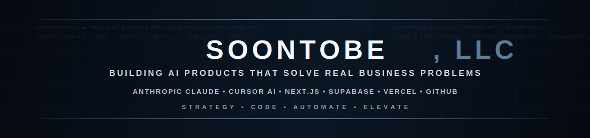

  

Hi, I'm Tyler Sheffield!
-

AI Strategy & Business Innovation professional focused on building AI-powered software that solves real business problems.

I'm the founder of **SoonToBe, LLC**, where I'm developing AI-first products across fintech, music technology, and business automation.

## Why I Build

I enjoy taking ambiguous ideas, turning them into working software, and using AI to solve practical business problems. I'm particularly interested in designing systems that combine thoughtful product strategy with reliable AI workflows.

## 🚀 Current Projects

### 📈 TradePlot
An AI-powered trading intelligence platform that helps traders analyze charts, improve execution, and journal their performance.

**Tech**
- Anthropic Claude
- Cursor AI
- Next.js
- Supabase
- Vercel
- GitHub

---

### 🎵 EchoPulse
An AI platform helping artists understand their music, learn to market, and grow their music through intelligent analytics and automation.

---

## 🛠 Tech Stack

- Anthropic Claude
- Cursor AI
- Next.js
- React
- TypeScript
- Supabase
- PostgreSQL
- Vercel
- GitHub
- SQL

---

## 🌱 Currently Learning

- Agentic AI
- Claude API
- AWS Certified AI Practitioner
- AI System Design
- Prompt Engineering
- Retrieval-Augmented Generation (RAG)
- Production AI Applications

---

## 🎯 Interests

- AI Strategy
- Product Development
- Business Innovation
- FinTech
- Music Technology
- AI Automation
